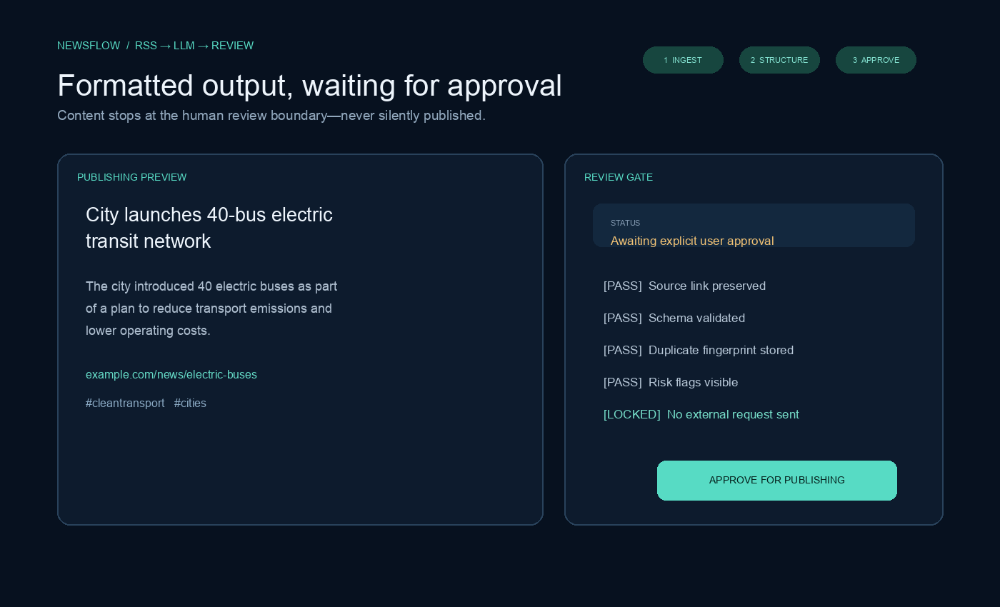
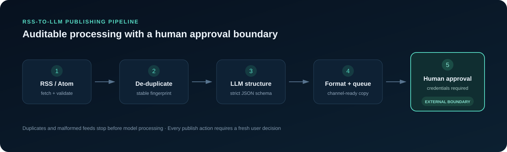
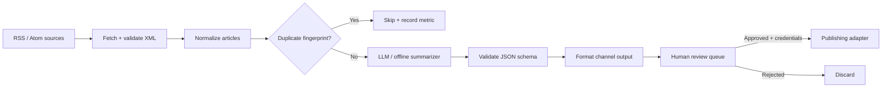
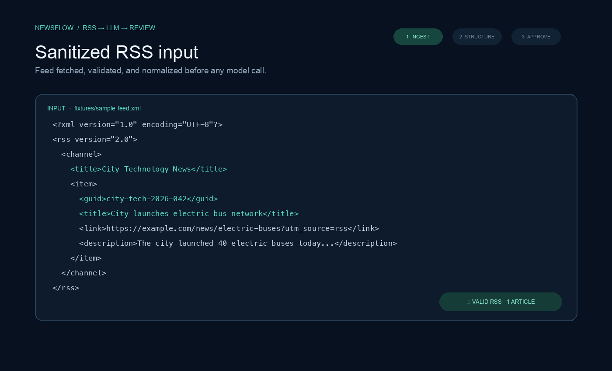
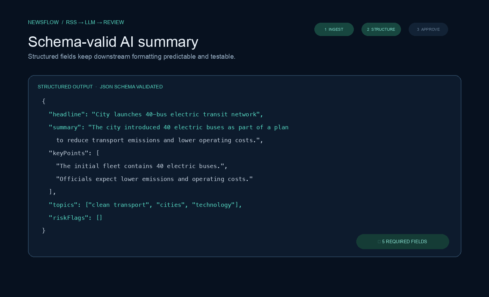

# RSS-to-LLM Content Processing and Publishing Pipeline

[](https://github.com/mouhamed1slem-bouazizi/Automated-News-Sharing/actions/workflows/tests.yml)
[](manifest.json)
[](LICENSE)

An auditable Chrome extension pipeline that ingests RSS/Atom feeds, removes duplicate articles, converts content into schema-validated AI summaries, formats channel-ready copy, and holds every item for explicit human approval. It includes a credential-free offline demo, sanitized fixtures, automated tests, and portfolio evidence.



## Why this project exists

News automation is not just “fetch, summarize, post.” A reliable workflow must reject malformed feeds, avoid reposting the same story, constrain model output, preserve source links, and prevent unreviewed content from reaching external accounts. This project demonstrates those production-minded controls in a small, inspectable codebase.

## Architecture





The extension service worker orchestrates scheduled feed checks. Pure utilities are separated from browser APIs so duplicate, validation, and formatting behavior can be tested using Node's built-in test runner.

## Evidence

| RSS input | Structured summary | Formatted approval output |
|---|---|---|
| [View fixture](fixtures/sample-feed.xml) | [View JSON](fixtures/structured-summary.json) | [View output](fixtures/formatted-output.txt) |
|  |  |  |

Short demo: [MP4 video](docs/upwork-demo.mp4) · [Animated preview](docs/upwork-demo.gif)

All evidence uses fictional `example.com` data. No client, employer, or workplace information is included.

## Pipeline stages

1. **Ingest** — fetch RSS or Atom using an explicit XML accept header.
2. **Validate** — reject empty, HTML, truncated, or unsupported feed responses with clear errors.
3. **Normalize** — remove tracking query parameters and normalize article fields.
4. **De-duplicate** — create stable fingerprints from GUIDs, canonical URLs, or title/date fallbacks.
5. **Enrich** — use the offline deterministic summarizer or the OpenAI Responses API.
6. **Constrain** — validate `headline`, `summary`, `keyPoints`, `topics`, and `riskFlags` against the documented structure.
7. **Format** — produce length-aware publishing copy that preserves the source URL.
8. **Review** — queue content as `awaiting_user_approval`; never publish in the background.
9. **Publish** — require a fresh user confirmation and user-provided publisher credentials.

## Structured LLM output

```json
{
  "headline": "City launches 40-bus electric transit network",
  "summary": "The city introduced 40 electric buses as part of a plan to reduce transport emissions and lower operating costs.",
  "keyPoints": [
    "The initial fleet contains 40 electric buses.",
    "Officials expect lower emissions and operating costs."
  ],
  "topics": ["clean transport", "cities", "technology"],
  "riskFlags": []
}
```

Live enrichment uses the OpenAI Responses API with strict Structured Outputs. The model is configurable; `gpt-5-mini` is the included default. See the official [Structured Outputs guide](https://developers.openai.com/api/docs/guides/structured-outputs) and [model documentation](https://developers.openai.com/api/docs/models/gpt-5-mini).

## Safe publishing boundary

> **External publishing requires credentials supplied by the user and explicit approval of the exact formatted post.**

This portfolio build deliberately stops at a `ready_for_adapter` result. It does not contain a live X/Twitter write request, bundled tokens, OAuth secrets, or a hidden auto-post path. A production integration must add an OAuth 2.0 adapter, request the minimum scopes, comply with the publisher's terms, and retain the approval gate.

API keys are optional. Demo mode is enabled by default and performs no OpenAI or publishing network calls. Never commit credentials; configure them only in the local extension settings.

## Run the offline demo

Requirements: Node.js 20 or newer. No dependency installation or API key is required.

```bash
git clone https://github.com/mouhamed1slem-bouazizi/Automated-News-Sharing.git
cd Automated-News-Sharing
npm run demo
```

## Run the tests

```bash
npm test
```

The suite covers:

- duplicate GUID detection;
- canonical-URL tracking variants;
- previously processed fingerprints;
- valid RSS and Atom feed envelopes;
- empty responses, HTML error pages, and truncated RSS/Atom XML;
- structured demo output and maximum-length formatting.

## Load the Chrome extension

1. Open `chrome://extensions/`.
2. Enable **Developer mode**.
3. Select **Load unpacked** and choose this repository.
4. Open **Pipeline settings**, add a public RSS URL, and keep demo mode enabled for a credential-free trial.
5. Enable feed monitoring or select **Run pipeline**.
6. Review queued content. Approval never sends data externally in this portfolio build.

## Project structure

```text
background.js                 Pipeline orchestration
js/
├── rss-parser.js             RSS/Atom validation and parsing
├── pipeline-core.js          Pure deduplication, schema, and formatting logic
├── pipeline-service.js       Processing workflow
├── openai-service.js         Optional Responses API adapter
├── publishing-service.js     Credential and approval boundary
└── storage-service.js        Chrome-local settings and queue storage
tests/                        Node test suite
fixtures/                     Sanitized input and expected outputs
docs/                         Architecture, screenshots, and demo recording
```

## Limitations and responsible use

- RSS publishers can change schemas or block browser-origin requests.
- Feed content can contain prompt injection, misinformation, or malicious markup; output still requires human review.
- The offline summarizer is a deterministic demonstration, not a semantic substitute for an LLM.
- Structured output guarantees shape, not factual accuracy. Review summaries against the linked source.
- Fingerprints minimize duplicates but cannot identify every syndicated or substantially rewritten article.
- Browser storage is appropriate for a portfolio demo, not centralized enterprise secret management.
- Respect copyright, feed terms, platform automation rules, rate limits, attribution requirements, and applicable law.

## License

[MIT](LICENSE)
